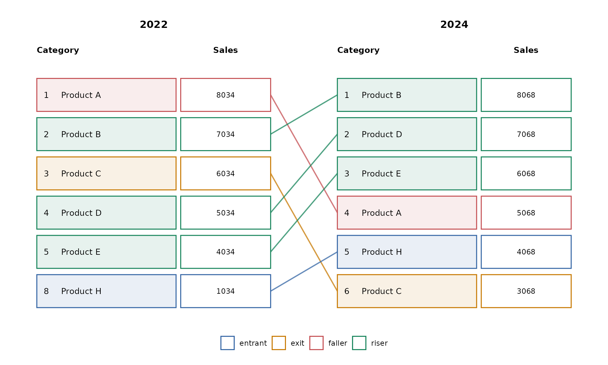
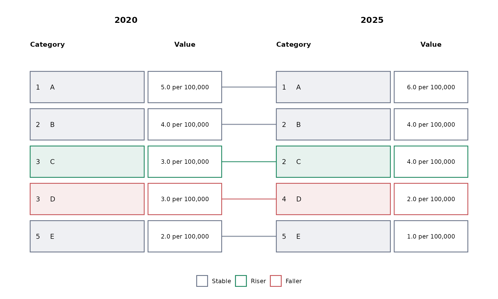
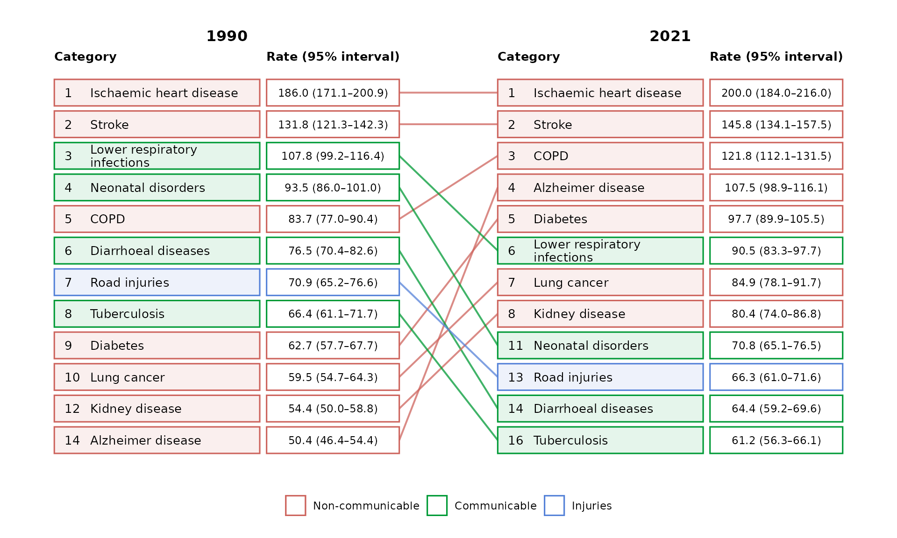
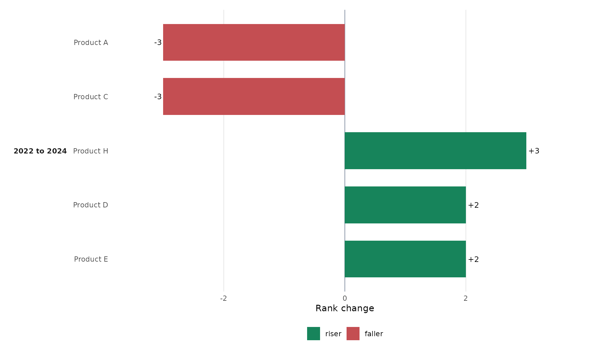

# Creating your first ggrank plot

`ggrank` shows how categories move through an ordered ranking while
retaining their underlying values. Start with one row per category and
period and map the three required columns.

> **Teaching-data notice:** All datasets bundled with `ggrank` are
> synthetic. They do not contain Global Burden of Disease estimates.
> `ggrank` is an independent project and is not affiliated with or
> endorsed by the Institute for Health Metrics and Evaluation (IHME).

``` r

library(ggrank)

ggrank(
  ggrank_products,
  category = product,
  period = year,
  value = sales,
  periods = c(2022, 2024),
  top_n = 5,
  value_header = "Sales"
)
```



The boundary view is the default: a category outside the top five
remains in the figure when it enters or exits the top five in another
displayed period.

## Let ggrank calculate the ranks

Users normally supply values rather than ranks. Inspect the calculation
with
[`ggrank_data()`](https://thinkdenominator.github.io/ggrank/reference/ggrank_data.md):

``` r

tied_rates <- data.frame(
  year = rep(c(2020, 2025), each = 5),
  organism = rep(c("A", "B", "C", "D", "E"), 2),
  rate = c(5, 4, 3, 3, 2, 6, 4, 4, 2, 1)
)

ggrank_data(
  tied_rates,
  category = organism,
  period = year,
  value = rate
)
#>    category period value rank display_position label group
#> 1         A   2020     5    1                1     5  <NA>
#> 2         B   2020     4    2                2     4  <NA>
#> 3         C   2020     3    3                3     3  <NA>
#> 4         D   2020     3    3                4     3  <NA>
#> 5         E   2020     2    5                5     2  <NA>
#> 6         A   2025     6    1                1     6  <NA>
#> 7         B   2025     4    2                2     4  <NA>
#> 8         C   2025     4    2                3     4  <NA>
#> 9         D   2025     2    4                4     2  <NA>
#> 10        E   2025     1    5                5     1  <NA>
```

Ranking uses exact numeric values. Equal values share a competition rank
by default (`1, 2, 3, 3, 5`) but receive separate alphabetical display
positions. All categories tied at the `top_n` boundary are included, so
a top-ten figure can contain more than ten boxes. Do not filter to the
top N before calling the package, because doing so prevents entrant and
exit detection.

Display formatting is independent of ranking. For example, rank an
unrounded rate while printing a prepared one-decimal label:

``` r

formatted_rates <- transform(
  tied_rates,
  rate_label = sprintf("%.1f per 100,000", rate)
)

ggrank(
  formatted_rates,
  category = organism,
  period = year,
  value = rate,
  label = rate_label
)
```



## Group colours and prepared labels

Use `group` for meaningful category colours and `label` when values
require a domain-specific display format. Supplied ranks are also
supported.

``` r

ggrank(
  ggrank_causes,
  category = cause,
  period = year,
  value = rate,
  rank = rank,
  label = display_value,
  group = cause_group,
  periods = c(1990, 2021),
  top_n = 10,
  value_header = "Rate (95% interval)"
)
```



The returned value is a regular ggplot object, so titles, captions, and
other ggplot2 layers can be added normally.

## Inspect the underlying comparison

[`ggrank_table()`](https://thinkdenominator.github.io/ggrank/reference/ggrank_table.md)
returns a readable analytical companion with one row per category and
adjacent transition.

``` r

changes <- ggrank_table(
  ggrank_products,
  category = product,
  period = year,
  value = sales,
  periods = c(2022, 2024),
  top_n = 5
)

changes
#>    category from   to rank_from rank_to rank_change value_from value_to
#> 1 Product B 2022 2024         2       1           1       7034     8068
#> 2 Product D 2022 2024         4       2           2       5034     7068
#> 3 Product E 2022 2024         5       3           2       4034     6068
#> 4 Product A 2022 2024         1       4          -3       8034     5068
#> 5 Product H 2022 2024         8       5           3       1034     4068
#> 6 Product C 2022 2024         3       6          -3       6034     3068
#>   value_change label_from label_to group missing_from missing_to  status
#> 1         1034       7034     8068  <NA>        FALSE      FALSE   riser
#> 2         2034       5034     7068  <NA>        FALSE      FALSE   riser
#> 3         2034       4034     6068  <NA>        FALSE      FALSE   riser
#> 4        -2966       8034     5068  <NA>        FALSE      FALSE  faller
#> 5         3034       1034     4068  <NA>        FALSE      FALSE entrant
#> 6        -2966       6034     3068  <NA>        FALSE      FALSE    exit
```

Visualise the largest rises and falls directly from that table. Positive
values moved towards rank one; negative values moved away from rank one.

``` r

ggrank_change(changes, top = 5)
```



## Use the graphical interface

Launch the optional local Shiny interface when you prefer to choose
columns and settings interactively:

``` r

ggrank_app()
```

Start with either synthetic teaching dataset or upload a CSV. The GUI
presents the rank chart, change chart, analytical table, and calculated
rank data in separate tabs. Close the Shiny window or stop the R process
to return to the console.
