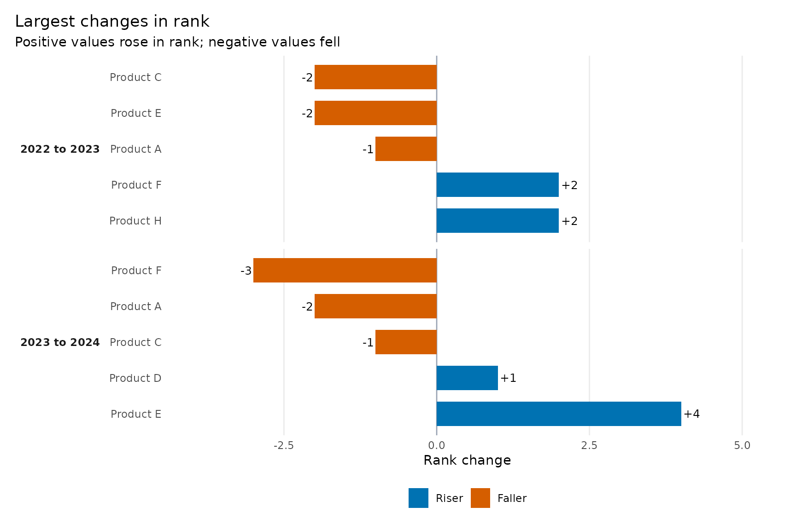
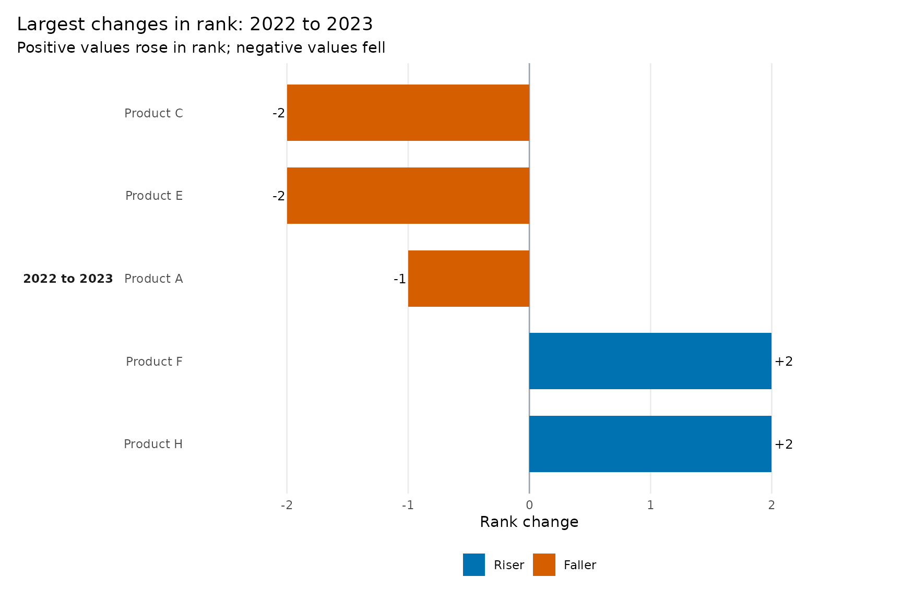
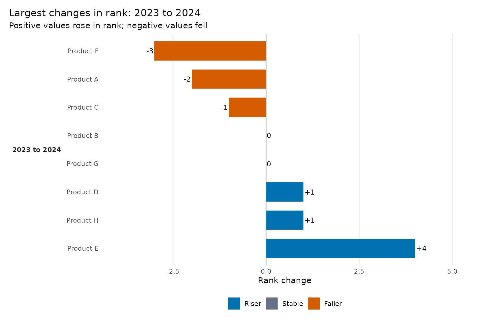
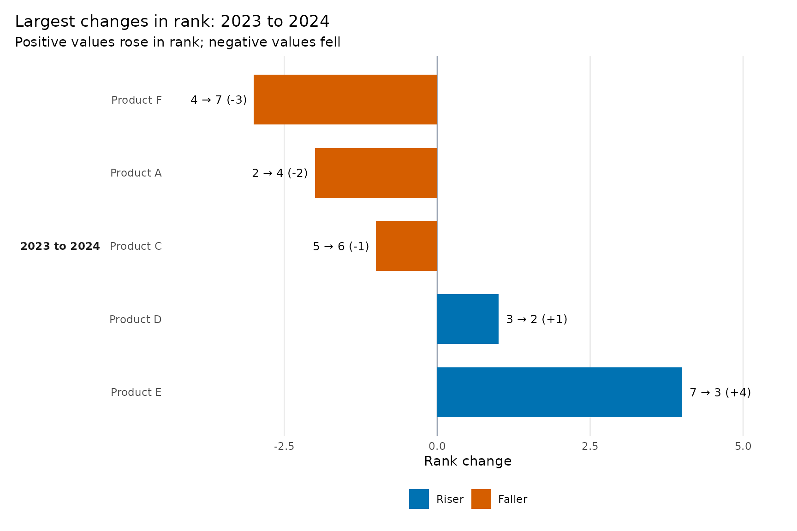
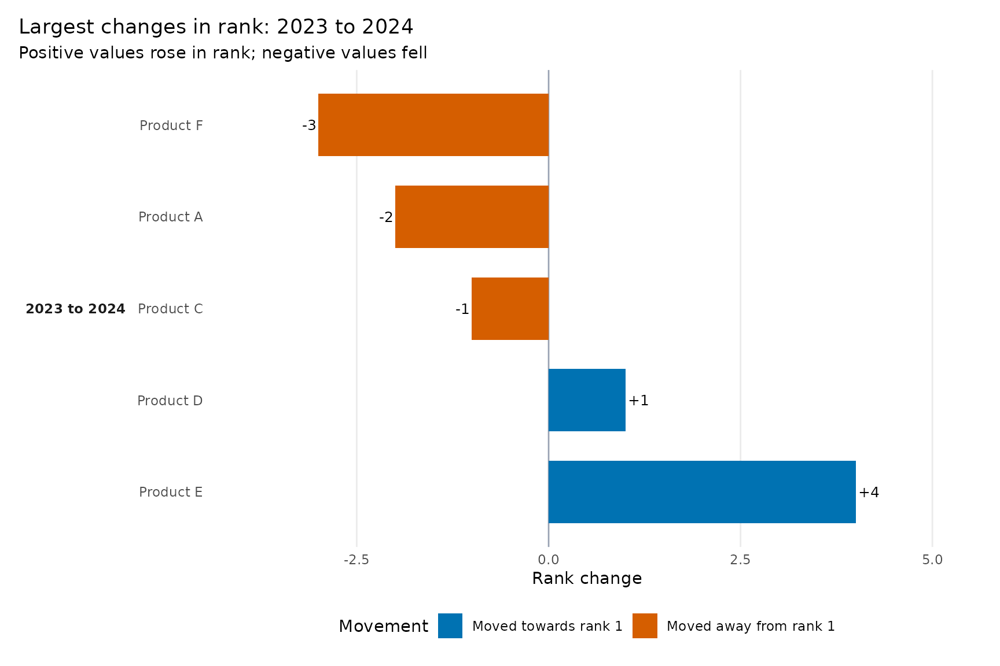
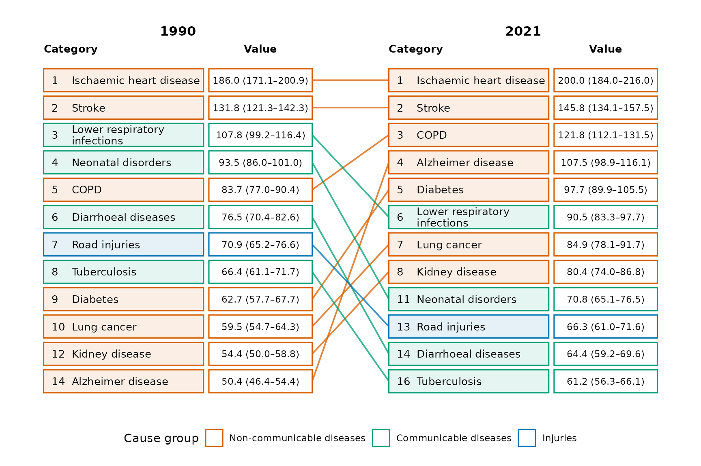

# Rank changes, movement status, and legends

`ggrank` has two primary visual questions:

- [`ggrank()`](https://thinkdenominator.github.io/ggrank/reference/ggrank.md)
  asks **How did the ranking evolve?**
- [`ggrank_change()`](https://thinkdenominator.github.io/ggrank/reference/ggrank_change.md)
  asks **Who moved the most?**

Both use the same ranks. The change chart is not a second ranking
algorithm.

## How rank change is calculated

For each adjacent comparison:

``` text
rank_change = rank_from - rank_to
```

Rank 7 to rank 3 is `+4`: the category rose four positions. Rank 2 to
rank 5 is `-3`: it fell three positions. Rank 3 to rank 3 is zero.
Competition ties remain statistical ties; `display_position` only
prevents tied categories from overlapping in
[`ggrank()`](https://thinkdenominator.github.io/ggrank/reference/ggrank.md).

``` r

library(ggrank)

changes <- ggrank_table(
  ggrank_products, product, year, sales,
  top_n = 5,
  show_transitions = "all"
)

changes[c("category", "from", "to", "rank_from", "rank_to",
          "rank_change", "status")]
#>     category from   to rank_from rank_to rank_change  status
#> 1  Product B 2022 2023         2       1           1   riser
#> 2  Product A 2022 2023         1       2          -1  faller
#> 3  Product D 2022 2023         4       3           1   riser
#> 4  Product F 2022 2023         6       4           2 entrant
#> 5  Product C 2022 2023         3       5          -2  faller
#> 6  Product H 2022 2023         8       6           2   riser
#> 7  Product E 2022 2023         5       7          -2    exit
#> 8  Product G 2022 2023         7       8          -1  faller
#> 9  Product B 2023 2024         1       1           0  stable
#> 10 Product D 2023 2024         3       2           1   riser
#> 11 Product E 2023 2024         7       3           4 entrant
#> 12 Product A 2023 2024         2       4          -2  faller
#> 13 Product H 2023 2024         6       5           1 entrant
#> 14 Product C 2023 2024         5       6          -1    exit
#> 15 Product F 2023 2024         4       7          -3    exit
#> 16 Product G 2023 2024         8       8           0  stable
```

## What each status means

[`ggrank_table()`](https://thinkdenominator.github.io/ggrank/reference/ggrank_table.md)
preserves boundary and data-availability information:

| Status | Meaning |
|----|----|
| `riser` | Rank improved and the category did not cross into the selected top N. |
| `faller` | Rank worsened and the category did not cross out of the selected top N. |
| `stable` | Statistical rank did not change. |
| `entrant` | Moved from outside the top-N boundary to inside it. |
| `exit` | Moved from inside the top-N boundary to outside it. |
| `new` | No earlier-period rank is available. |
| `absent` | No later-period rank is available. |
| `missing` | A non-finite value was supplied for either side. |

The
[`ggrank_change()`](https://thinkdenominator.github.io/ggrank/reference/ggrank_change.md)
colour is intentionally simpler. It uses the sign of `rank_change`: an
entrant moving 6 to 4 is shown as a riser; an exit moving 3 to 7 is
shown as a faller. The original `status` remains in the plot data.

## Latest, all, and explicit comparisons

The default focuses on the latest consecutive comparison and removes
stable categories:

``` r

ggrank_change(changes, top = 5)
```


`top = 5` means the five largest absolute rank changes in the selected
comparison—not five risers plus five fallers.

``` r

ggrank_change(changes, top = 5, comparison = "all")
```



Select a comparison already represented in the table with `from` and
`to`:

``` r

ggrank_change(changes, from = 2022, to = 2023, top = 5)
```



Stable categories are optional:

``` r

ggrank_change(changes, top = 8, show_stable = TRUE)
#> Warning: Removed 2 rows containing missing values or values outside the scale range
#> (`geom_point()`).
```



## Detailed labels and long names

``` r

ggrank_change(
  changes,
  top = 5,
  change_label = "ranks",
  label_wrap = 24
)
```



Use `change_label = "change"` for `+4` and `-3`, `"ranks"` for
`7 → 3 (+4)`, or `"none"` for no bar-end annotation.

## Customise movement colours and legend text

``` r

movement_colours <- c(
  riser = "#0072B2",
  faller = "#D55E00",
  stable = "#667085"
)

movement_labels <- c(
  riser = "Moved towards rank 1",
  faller = "Moved away from rank 1",
  stable = "No rank change"
)

ggrank_change(
  changes,
  top = 5,
  palette = movement_colours,
  legend_title = "Movement",
  legend_labels = movement_labels
)
```



Set `show_legend = FALSE` when direction, labels, and explanatory text
make the legend unnecessary. Because the result is a ggplot, standard
scale and theme functions remain available for further refinement.

## Customise group legends in `ggrank()`

When `group` is supplied, `colour_by = "auto"` uses its values. Palette
and legend-label names must match those values exactly.

``` r

cause_colours <- c(
  "Communicable" = "#009E73",
  "Injuries" = "#0072B2",
  "Non-communicable" = "#D55E00"
)

cause_labels <- c(
  "Communicable" = "Communicable diseases",
  "Injuries" = "Injuries",
  "Non-communicable" = "Non-communicable diseases"
)

ggrank(
  ggrank_causes, cause, year, rate,
  rank = rank, label = display_value, group = cause_group,
  periods = c(1990, 2021), top_n = 10,
  palette = cause_colours,
  legend_title = "Cause group",
  legend_labels = cause_labels
)
```



To use movement rather than group colours, choose
`colour_by = "movement"`. To hide the legend, use `show_legend = FALSE`.
